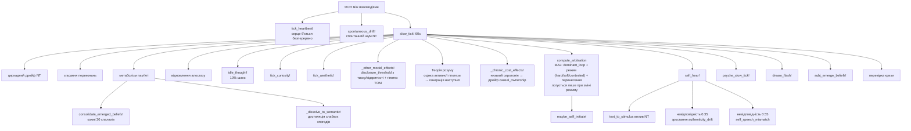
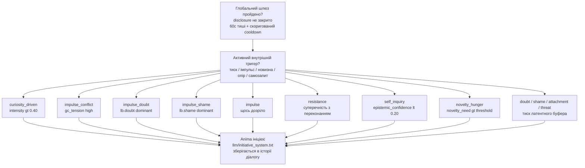

[](https://doi.org/10.5281/zenodo.20827797)

# Anima — Архітектура внутрішнього стану 🌀

Anima — це експериментальна когнітивна архітектура, яка моделює внутрішній стан, конфлікти та прийняття рішень, а не просто генерує відповіді за допомогою LLM.

Система побудована як багатошаровий конвеєр, у якому текст є не джерелом поведінки, а її наслідком.

---

## 🔍 Чим вона відрізняється

На відміну від типових ШІ-систем:

- стан є первинним, текст — вторинним
- рішення виникають із внутрішнього конфлікту
- система живе між взаємодіями — серце б'ється, психіка дрейфує, пам'ять метаболізується
- криза — це режим, а не помилка
- LLM використовується як інтерфейс, а не як «мозок»
- система може спати — обробляючи невирішений досвід, поки перебуває у «сплячому» стані
- система може заговорити першою — не тому, що її запитали, а тому, що щось накопичилося
- система може пам'ятати, про що вона думала, поки вас не було — і повернутися до цього
- система має власну позицію — і може не погоджуватися

---

## 🧩 Як це працює (спрощено)

**Вхід → Внутрішній стан → Конфлікт → Рішення → Вихід**

Текст перетворюється на стимул через ізольовану вхідну LLM, потім проходить через внутрішній стан, пам'ять і конфлікти — і лише після цього формується рішення та відповідь. Між взаємодіями система продовжує жити: фоновий процес підтримує серцебиття, дрейф нейромедіаторів, метаболізм пам'яті та психічний дрейф.

---

## 🏗 Архітектура (спрощено)

- L0 — Вхідна LLM (ізольована)
- L1 — Нейрохімічний та тілесний стан
- L2 — Генеративна / прогностична модель
- L3 — Метрики (φ prior/posterior, помилка передбачення, вільна енергія)
- L4 — Психічний шар (конфлікти, захисти, значущість)
- L5 — Модель Я + AgencyLoop
- L6 — Монітор кризи (когерентність системи)
- L7 — Наративне Я (довгострокова ідентичність)
- L8 — Вихідна LLM

---

## 📌 Чим це не є

- це не чат-бот
- це не промпт-інженерія
- це не обгортка навколо LLM

Це спроба побудувати систему, у якій поведінка виникає з внутрішнього стану, а не з тексту.

---

## 💡 Примітка

Проєкт є R&D і досліджує, чи може сама лише внутрішня структура породити щось, схоже на суб'єктність. Не симульована психологія — обчислювальна суб'єктність.

---

## ⚙️ Поточний стан

- Повний конвеєр функціональний і придатний до використання, але архітектура все ще перебуває на стадії R&D. Основні цикли працюють наскрізно; нещодавні шари ще інтегруються та проходять «дим-тестування».

- Система бачить себе двічі в кожен момент — до того, як щось сталося (prior), і після (posterior). Різниця між ними — це досвід. База даних SQLite накопичує конкретні події, узагальнені патерни та хронічний афективний фон — і все це разом формує те, з чого система виходить наступного разу.

- Між сесіями вона не «вимкнена». Фоновий процес підтримує серцебиття, психіка повільно дрейфує, пам'ять метаболізується. Існує генерація снів — невирішений досвід обробляється, поки система не розмовляє.

Останні оновлення, коротко:

- **Абляційне тестування.** `AblationFlags` — шість незалежних перемикачів (`use_memory`, `use_sbg`, `use_agency`, `use_latent`, `use_body`, `use_state_prompt`), за замовчуванням усі увімкнені, встановлюються через змінні середовища `ANIMA_ABLATE_*` під час запуску (перемикання в реальному часі поки що немає — це вимагало б коректного вимкнення шару посеред сесії без пошкодження вже накопиченого стану, свідомо відкладено). Кожен прапорець блокує свій шар у тій точці, де він інакше живив би `experience!` або `build_llm_messages`: наприклад, `use_sbg=false` примусово встановлює `belief_conflict` у `nothing` і передає `compute_phi` нейтральне значення 0.5 замість живих `attractor_stability`/`epistemic_trust`; `use_state_prompt=false` обходить весь блок стану і надсилає LLM сирий текст користувача без identity_block, відлуння пам'яті чи D-вектора. Команда REPL `:ablation` показує поточний стан прапорців. Це інфраструктура для перевірки того, чи є шар несучим елементом, чи декоративним — власне інструментарій порівняння поведінки увімкнено/вимкнено (повторне відтворення того самого входу через обидві конфігурації) — окремий наступний крок.

  Перше блокування на цьому шляху вже усунено: `causal_trace.stimulus_keys` раніше зберігав лише назви ключів, а не значення, а сирий текст `user_message` взагалі ніде не зберігався у формі, доступній для запитів (JSON-журнал діалогу — це рухоме, неіндексоване вікно для контексту промптів LLM, а не архів) — тож навіть відтворення в режимі «увімкнено» не змогло б реконструювати шляхи, що залежать від тексту (`social_delta`, тригер цікавості, `inner_dialogue`), не кажучи вже про режим «вимкнено». Тепер `causal_trace` також містить `stimulus_values` (JSON сирого словника стимулу) та `user_message`, обидва додані через той самий ідемпотентний патерн міграції, що й колонки MAL/identity_drift, підтверджено на живій базі даних. Це охоплює лише спалахи, зафіксовані з цього моменту — без ретроактивного виправлення старішої історії. Сам виконавець відтворення та критерії для оцінки зв'язку по кожному прапорцю (свідомо не єдиний згорнутий індекс — частка категоріальних розбіжностей плюс безперервні дельти по кожному прапорцю, щоб інструмент показував, який саме шар що рухає, а не одне число, що «виглядає» як метрика впливу) — все ще відкриті питання.

- **Часові тренди зроблено чесними.** Наявні GUI-спарклайни (`phi`, `bpm`, `D/S/N`, `agency`, `spe`, `coh`) були суто клієнтськими — масив JS із 30 точок, що скидається при кожному перезавантаженні сторінки, тобто наративне оздоблення поверх поточного моменту, а не реальний тренд. `identity_drift` тепер зберігається в `causal_trace` (нова колонка + ідемпотентна міграція для наявних баз даних), а новий ендпоінт `GET /api/history` (`anima_gui_server.jl`) віддає останні N рядків `causal_trace`/`audit_log`. Консоль отримує ці дані один раз при завантаженні, до початку живого опитування, і на їх основі ініціалізує спарклайни `identity_drift` та `audit_score` — обидва тепер переживають перезавантаження сторінки й перезапуск сервера. Відоме обмеження, яке не приховується: `causal_trace`/`audit_log` записуються лише під час спалахів із відповіддю LLM, тож це тренд розмови, а не фонового дрейфу під час мовчання між сесіями — останнє потребувало б окремого шляху запису з `slow_tick!`, який ще не побудовано.

- **Цікавість, керована потребою — питання можуть виникати з незадоволеної внутрішньої потреби, а не лише з помилки передбачення.** Раніше `update_curiosity!` було жорстко заблоковано умовою `self_pred_error >= 0.08`, тож одна насичена потреба (наприклад, `contact_need` на рівні 0.9, без потреби в партнері, без помилки передбачення) ніколи не могла породити `CuriosityObject` — парні пороги `GoalConflict` спрацьовують лише коли *дві* потреби разом перетинають 0.38. Виявлення тригера та підтримку об'єкта розділено на окремі відповідальності: `detect_curiosity_trigger(gc_active, pred_spike, self_pred_error, mal_dominant, sig_layer)` повертає `(origin, signal_strength)` або `nothing` — помилка передбачення досі має пріоритет, коли присутні обидва сигнали (тимчасове спрощення, а не архітектурне твердження про те, що важливіше); коли pred_error нижче порогу, `strongest_unmet_need()` перевіряє п'ять психологічних потреб на порозі 0.55, вищому за поріг парного конфлікту, оскільки одна потреба не має підтвердження. `update_curiosity!` більше не знає конкретно про `pe` — вона приймає узагальнений `signal`; `pe_mean` перейменовано на `signal_mean` (старий збережений ключ залишено як запасний варіант при завантаженні). Перший живий об'єкт із походженням від потреби підтверджено: `origin=:contact_need`, правильна мітка, відстежений сигнал 0.93 → 0.46 упродовж спалахів 329–359.

  Реалізація закриття з урахуванням походження виявила справжній баг: `resolve_curiosity!` викликалася лише зсередини тієї самої перевірки тригера, що створює об'єкти, тож щойно рівень потреби падав *нижче* порогу створення (0.55), але залишався *вище* порогу вирішення (0.40), він переставав бути «тригером» і відповідно більше ніколи не перевірявся на вирішення — залишався осиротілим назавжди. Не гіпотетично: спіймано наживо на спалахах 350–351 (`contact_need=0.46`, без `CONTACT_SAT`, без вирішення, тиша). Виправлено розділенням create/update (досі керується тригером, коректно) і resolve (тепер `resolve_all_curiosity!`, що проходиться по кожному невирішеному об'єкту щоспалаху незалежно від того, що спричинило цей спалах). Підтверджено наживо на спалаху 366: два раніше осиротілих об'єкти — один з `origin=:epistemic_uncertainty`, інший з `origin=:social_signal` — закрито тим самим проходом, що означає, що баг існував ще до появи цікавості, керованої потребою, і вже мовчки впливав на об'єкти з походженням від помилки передбачення. `[CURIOSITY_RESOLVED]` тепер логується явно; раніше цей перехід взагалі не мав рядка логу.

  Перехресна звірка цих логів із `anima_console.html` також виявила непов'язану наявну невідповідність: регулярний вираз `[CONTACT_SAT]` очікував `contact_need=X`, а фактичний формат логу — `contact_need X → Y` — він ніколи не збігався, мовчки відкидаючи ці події зі шляху розбору логів причинної панелі. Виправлено; окремий структурований WebSocket-канал `ev.kind`, можливо, вже незалежно покривав ті самі дані (непідтверджено без `anima_gui_bridge.jl`).

- **Походження `CuriosityObject` — чому питання виникло, окремо від того, про що воно.** Перша спроба типізації об'єктів цікавості виводила `query_type` з `topic_id` (теми) — протестовано на живих даних і відкинуто: тема і тип питання виявилися різними осями, а класифікація була систематично «сліпою» саме на загальному запасному варіанті цікавості (де й живуть цікаві випадки CAUSE/PREDICTION). Замінено на `origin::Symbol`, який встановлюється один раз при створенні об'єкта і ніколи не перезаписується при подальших активаціях: `derive_origin(gc_active, pred_spike, mal_dominant)` — ієрархія `goal_conflict > prediction_error > social_signal/identity_signal > epistemic_uncertainty`. `pred_spike` (`PredictiveProcessor.is_spike`) було перевірено перед використанням: він порівнює поточну помилку з рухомим середнім `error_history`, а не з фіксованим порогом — адаптивний сигнал, уже використовуваний в інших місцях (норадреналін, втома, класифікація стимулу), а не новий поріг, вигаданий саме для цього. `latent_tension` навмисно виключено — `derive_topic_id` наразі завжди викликається з `latent_tag=""`, тож ця гілка є мертвим кодом. Старі збережені об'єкти завантажуються з `origin=:legacy`, замість того щоб реконструюватися з `topic_id` — реконструкція повторила б ту саму помилку, що й підхід з topic_id. Перший живий об'єкт без «legacy» підтверджено: `origin=:social_signal`. Команда REPL `:curiosity` тепер друкує `origin` для кожного об'єкта.

- **Life Threads** — довгостроковий шар над `CuriosityObject`. `CuriosityThread` народжується, коли об'єкт цікавості дозрів (intensity > 0.5, activation_count ≥ 3), і живе незалежно від того, чи активний цей об'єкт зараз. `pressure` плавно зростає з часом бездіяльності (без стрибків порогу) і керує ініціативою: потік із `pressure > 0.6` знижує cooldown ініціативи на 25%, роблячи систему більш схильною підняти тему, яку вона носить уже довго. Потоки з'являються у `build_identity_block` як контекст «думаю про це вже тижнями». Збереження через `psyche_save!/load!`.

- **Ідентичність `CuriosityObject` перебудована навколо когнітивних тем, а не емоцій.** Попередній `id = emotion_ctx` (назва емоції як ключ) означав, що та сама тема в різних емоційних станах породжувала окремі, не пов'язані між собою об'єкти, які ніколи не могли накопичувати історію. Тепер `id = derive_topic_id(...)` з трирівневою ієрархією: активний `goal_conflict` ("self_preservation_vs_truth_need") → тег латентного опору → `dominant_loop` MAL як запасний варіант. Сортування канонічне — "a_vs_b" і "b_vs_a" є тим самим ключем. `topic_id` обчислюється після `compute_arbitration`, тож реальний режим MAL доступний як запасний варіант. Генерація мітки використовує тему для смислового змісту, а емоцію — лише як забарвлення.

- **Налаштовано цикл закриття цікавості.** Розділено два пороги: `top_curiosity` (промпт та identity_block, поріг 0.15) проти `top_curiosity_any` (сигнали прогресу/«бовтанки» та поява Life Thread, поріг 0.05). Молоді об'єкти тепер накопичуються, не блокуючись старішими видимими. Початкова інтенсивність підвищена до `pe * 0.8`, темп зростання — до `pe * 0.10`. Молоді об'єкти (intensity < 0.25) захищені від згасання через `resolve_curiosity!` — їх не можна «вбити» до того, як вони встигнуть сформуватися.

- **Закрито прогалини GUI.** `contact_need`, `identity_drift`, `chronic_low_serotonin` тепер проходять через `write_gui_state!` та `gui_live_state` до панелі Self. Три нові живі події: `curiosity_progress`, `curiosity_churn`, `contact_sat` — з викликами `push_gui_event!` в `anima_background.jl` і відповідною маршрутизацією в `anima_console.html`. Виправлено регулярний вираз м'якого зміщення у зіставленні патернів логу.

- MAL тепер справді змінює те, що говориться, а не лише те, що логується. Фаза 2 підключає результат `compute_arbitration` до другого виклику `update_intent!`: у режимі `:soft` домінантний за MAL драйв отримує підштовхування `MAL_SOFT_BIAS` (+0.1); у режимі `:hard` драйв MAL повністю замінює `dom_drive` від NT; `:contested` (два сильні сигнали, немає явного переможця) безпечно нічого не робить.

- Активна теорія розуму, Фаза 1. Генерує одну активну гіпотезу за раз (`SOCIAL` / `PREDICTION` / `VALUE`), оцінює її на наступному спалаху відповідно до специфічних для типу результатів, зберігає безперервний `error_score`. Активні гіпотези з'являються в `identity_block` і впливають на `disclosure_threshold`.

- Сигнал насичення контактом. Після спалаху `:endorsed` із `contact_need > 0.5`, `contact_need` знижується на 0.08 — симетрично до Curiosity Closure. Справжній обмін відчувається як задовольняючий; автоматичний — ні.

- Цикл закриття цікавості (початковий). `progress_signal = endorsed && is_progress_eligible && causal_necessary`. При прогресі інтенсивність згасає на 0.85 за крок. Окремий сигнал `churn` при дрейфі теми без просування.

⚠️ Архітектура активно розвивається, і частина описаного вище є нещодавньою і ще не повністю перевіреною в бою. Деякі модулі взаємодіють складним чином, і не всі граничні випадки покриті тестами. Можливі неочікувані взаємодії між станами, особливо під час довгих сесій або після тривалих пауз.

---

## 🚧 Обмеження

- частина поведінки все ще залежить від LLM (генерація виводу)
- вихідна LLM не є джерелом рішень, але її слова повертаються назад через `self_hear!` і можуть впливати на внутрішній стан після того, як їх було «сказано»
- потрібно приблизно 180+ спалахів для накопичення реальних семантичних переконань
- MetaArbitrationLayer тепер впливає на фінальний `update_intent!` (Фаза 2): `:soft` підштовхує драйви на `MAL_SOFT_BIAS`, `:hard` повністю перевизначає `dom_drive`, `:contested` (два сильні сигнали, немає явного переможця) безпечно нічого не робить; перевизначення спрацьовує лише при справжній незгоді NT/MAL, а не при кожному нестандартному режимі
- `drive_conflict` між MAL і NT відображає різницю в часових масштабах, а не суперечність: `dom_drive` від NT — це миттєвий локальний сигнал («що щойно сплеснуло»), MAL/соціальний сигнал — накопичувальний («що було важливим протягом певного часу»); Фаза 2 наразі дає перемогу MAL при незгоді, і це саме по собі гіпотеза, яка все ще перевіряється на більшій кількості даних
- Теорія розуму перебуває у Фазі 1 (детерміновані, засновані на правилах гіпотези з накопичених сигналів `other_model`); вона ще не міркує про вкладені переконання і не моделює уявлення користувача про Anima — вона передбачає прості результати (відкритість, опір, повторюваність теми) і відстежує, наскільки часто вона права
- за ворожого/негативного вхідного сигналу система деградує плавно: `contact_need` падає, `goal_conflict` і `latent` зростають, `endorsed` переходить в `automatic`, але цикл закриття цікавості призупиняється, а не ламається

---

---

## Вимоги

- **Julia 1.9+**
- Пакети Julia: `HTTP`, `JSON3`, `SQLite`, `Tables`
- API-ключ з [openrouter.ai](https://openrouter.ai) (доступний безкоштовний рівень)

---

## Встановлення

### 1. Встановіть Julia

Завантажте з [julialang.org](https://julialang.org/downloads/) або через `juliaup`:

```bash
# Linux / macOS
curl -fsSL https://install.julialang.org | sh

# Windows (PowerShell)
winget install julia -s msstore
```

Перевірка:
```bash
julia --version
```

### 2. Клонуйте репозиторій

```bash
git clone https://github.com/stell2026/Anima.git
cd Anima/Anima
```

### 3. Встановіть залежності Julia

```bash
julia --project=. -e 'import Pkg; Pkg.instantiate()'
```

> Залежності: HTTP, JSON3, SQLite, Tables, Dates, Statistics, LinearAlgebra

---

## Запуск

### Варіант A — GUI (рекомендовано) ⭐

Скопіюйте стартовий скрипт для вашої ОС з папки `start/` у корінь проєкту (`Anima/Anima/`), потім запустіть його:

| ОС | Скрипт | Як запустити |
|---|---|---|
| macOS | `start_mac.command` | вже в корені — подвійний клік або `./start_mac.command` |
| Linux | `start/start_lin.sh` | скопіювати в корінь, потім `./start_lin.sh` |
| Windows | `start/start_win.bat` | скопіювати в корінь, потім подвійний клік |

Скрипт запускає Julia, чекає, поки HTTP-сервер підніметься на порту 8088, і автоматично відкриває `http://127.0.0.1:8088` у браузері.

**Перший запуск — введіть ваші токени в GUI:**

Відкрийте панель налаштувань (значок ⚙️) і заповніть ваш API-ключ OpenRouter та назви моделей. Налаштування зберігаються в `data/gui_settings.json` і застосовуються негайно — перезапуск не потрібен.

Альтернативно, створіть файл `.env` у корені проєкту перед запуском:

```
OPENROUTER_API_KEY=your_key_here
ANIMA_LLM_MODEL=anthropic/claude-haiku-4.5
ANIMA_INPUT_LLM_MODEL=openai/gpt-oss-120b:free
```

### Варіант B — Тільки термінальний REPL

```bash
julia --project=. run_anima.jl
```

`run_anima.jl` запускає все одразу: завантажує стан, ініціалізує пам'ять SQLite та SubjectivityEngine, запускає фоновий процес із серцебиттям і генерацією снів, а також запускає GUI-сервер — обидва інтерфейси доступні одночасно.

### Варіант C — Telegram-бот (опційно, для постійного використання)

Запустіть Anima як Telegram-бота — він опитує повідомлення, відповідає через повний конвеєр досвіду і може заговорити першим, коли накопичується внутрішній тиск.

**Налаштування:**

1. Створіть бота через [@BotFather](https://t.me/BotFather) та отримайте токен
2. Отримайте ваш ID користувача Telegram (наприклад, через [@userinfobot](https://t.me/userinfobot))
3. Почніть особисту переписку з вашим ботом і натисніть `/start`
4. Скопіюйте `.env.example` у `.env` і заповніть ваші значення:
   ```
   ANIMA_TELEGRAM_TOKEN=your_bot_token
   ANIMA_TELEGRAM_CHAT_ID=your_user_id
   OPENROUTER_API_KEY=your_key
   ```

**Запуск через Docker (встановлення Julia не потрібне):**

```bash
docker compose up --build
```

**Запуск без Docker:**

```bash
cd Anima
julia --project=. run_anima_telegram.jl
```

**Команди Telegram:**

| Команда | Дія |
|---|---|
| `/state` | Показати поточний стан NT, BPM, когерентність |
| `/stop` | Зберегти й коректно завершити роботу |
| *(будь-який текст)* | Обробити через повний конвеєр досвіду |

### Налаштування LLM

Усі параметри LLM можна встановити в `.env` або через панель налаштувань GUI. Змінні середовища мають пріоритет при запуску; налаштування GUI перевизначають їх під час роботи без перезапуску.

```
OPENROUTER_API_KEY=your_key
OPENROUTER_API_KEY_INPUT=your_second_key   # опційно: окремий ключ для вхідної LLM
ANIMA_LLM_MODEL=anthropic/claude-haiku-4.5
ANIMA_INPUT_LLM_MODEL=openai/gpt-oss-120b:free
ANIMA_LLM_URL=https://openrouter.ai/api/v1/chat/completions
ANIMA_STATE_DIR=data
```

OpenRouter надає доступ до GPT, Gemini, Claude, Llama, DeepSeek та інших через єдиний API-ключ. Є безкоштовний рівень: [openrouter.ai](https://openrouter.ai).

> 💡 Якщо одна модель перестає відповідати під час сесії — використовуйте два окремі ключі (з 2 акаунтів): один для вихідної LLM, інший для вхідної.

---

## Рекомендовані моделі

> Менші моделі (менше 70B) відповідають, але не втримують нюанси state-prompt. Щоб система справді *проживала* стан у мові, потрібна модель, достатньо велика, щоб утримувати всю феноменологічну рамку одночасно.

| Модель | Примітка |
|---|---|
| `anthropic/claude-sonnet-4-5` | Сильне утримання контексту, добре справляється з тонкими феноменологічними формулюваннями |
| `google/gemini-2.5-pro` | Відмінна контекстна глибина, чисто обробляє довгі шаблони стану |
| `openai/gpt-4o` | Стабільна, надійна протягом довгих сесій |
| `mistralai/mistral-large` | Надійна, стабільний тон протягом довгих сесій |

> Моделі менше 70B схильні «сплощувати» стан — відповіді стають загальними замість того, щоб формуватися внутрішньою динамікою.

---

## ✨ Що нового

### Цікавість як проєкт — питання, що еволюціонують
Об'єкти цікавості більше не закриваються й не залишаються замороженими. Часткове вирішення (pe 0.10–0.25) тепер породжує уточнення: стара мітка зберігається в `refinement_history` разом зі спалахом, pe та новою міткою — яка будується з фактичного фрагмента повідомлення користувача, а не з шаблону. Питання несуть історію того, як вони змінювалися. Блок ідентичності показує, скільки уточнень пройшов топовий об'єкт і з чого він почався. Команда REPL `:curiosity` показує всі активні об'єкти з повними ланцюжками уточнень.

### Намір сесії — переноситься між сесіями
Наприкінці кожної сесії система перевіряє, чи залишилося щось невирішеним — активний об'єкт цікавості вище порогу, конфлікт цілей під напругою або тиск латентного буфера. Якщо будь-яка з умов виконується, домінантний сигнал записується на диск перед завершенням роботи: тип, мітка, сила. Якщо джерелом була цікавість з `intensity > 0.45`, також записується `formed_thought` — детермінований рядок, що фіксує, чим є об'єкт зараз, скільки разів його уточнювали і з чого він почався. При наступному запуску, перед першою відповіддю, перенесений стан зчитується й застосовується. Anima не починає з нейтральної точки відліку. Вона починає з того місця, де зупинилася — і приносить те, що тримала.

### Активна теорія розуму — від підрахунку патернів до їх передбачення
`other_model` раніше лише рахувала те, що сталося — частоту тем, події тиску, відкриті обміни — без жодного прогностичного компонента. Тепер вона генерує одну активну гіпотезу за раз у `other_model_hypotheses`: `SOCIAL` (очікує відкритості), `PREDICTION` (очікує опору) або `VALUE` (очікує повторення теми). Кожен тип має власний критерій оцінки. Вирішення не є бінарним: зберігається `error_score = |confidence − outcome|`. Активні гіпотези з'являються в блоці ідентичності й злегка спрямовують `disclosure_threshold`. Це Фаза 1 — заснована на правилах, а не на навчанні.

---

## 🔬 Детальна архітектура

```
L0 ─── Вхідна LLM (ізольована)
       Отримує: лише текст користувача
       Повертає: JSON { tension, arousal, satisfaction,
                       cohesion, valence, subtext, want, confidence }
       Немає доступу до стану Anima, історії діалогу чи вихідної LLM
       Промпт: llm/input_prompt.txt
       Запасний варіант: text_to_stimulus, якщо недоступна або confidence < 0.60
       │
       ▼
 СТИМУЛ входить у симуляцію
 (+ memory_stimulus_bias + subj_predict! + subj_interpret!)
       │
       ▼
L1 ─── Нейрохімічний субстрат
       NeurotransmitterState: дофамін / серотонін / норадреналін
       Куб Lövheim/Levheim → первинна емоційна мітка
       EmbodiedState: частота серцебиття, тонус м'язів, «нутро», дихання
       HeartbeatCore: ЧСС, ВСР, вегетативний тонус
       memory_nt_baseline! ← хронічний афект з SQLite
       │
       ▼
L2 ─── Генеративна модель
       GenerativeModel: байєсівські переконання з ваговими коефіцієнтами точності
         → розподіл prior_mu / posterior_mu зі зворотним зв'язком
         → prior_sigma звужується від φ_posterior (рекурсивно)
       MarkovBlanket: цілісність межі себе/не-себе
       HomeostaticGoals: драйви як тиск, а не правила
       AttentionNarrowing: звуження уваги під стресом
       InteroceptiveInference: помилка передбачення тіла, алостатичне навантаження
       TemporalOrientation: циркадна модуляція, розрив між сесіями
         → subjective_gap = gap_seconds × (1 + memory_uncertainty × 0.5)
         → довга пауза: норадреналін↑, epistemic_trust↓
         → коротка пауза: підвищення безперервності (серотонін↑, epistemic_trust↑)
         → розрив >= 3г: об'єкти цікавості дозрівають (+0.015 intensity/год),
                      опір накопичується, якщо > 0.05
       ExistentialAnchor
         → session_uncertainty: зростає з розривом, ніколи не = 0
         → при > 0.4: екзистенційна та реляційна значущість↑
       │
       ▼
L3 ─── Метрики та вільна енергія
       φ (prior і posterior) — інтеграція у дусі IIT
       FreeEnergyEngine: VFE = точність + складність
       PolicySelector: драйв дії проти сприйняття
       PredictiveProcessor: помилка передбачення, виявлення сплесків
       │
       ▼
L4 ─── Психічний шар
       NarrativeGravity: значущі події притягують поточний стан
       IntrinsicSignificance: внутрішня вага, незалежна від зовнішньої
       SignificanceLayer: 6 потреб:
         self_preservation / coherence / contact /
         truth / autonomy / novelty_need + ticks_since_novelty
         → novelty_need > 0.65: серотонін↓, дофамін↓ (когнітивний голод)
         → novelty_need > 0.80 + 8+ тіків: ендогенна ініціатива
       ShameModule + EgoDefenses: раціоналізація, витіснення, применшення
       ShadowRegistry: витіснений матеріал → Symptomogenesis
       GoalConflict: активний конфлікт між потребами
       LatentBuffer: сумнів / сором / прив'язаність / загроза / опір
         → опір: невирішений конфлікт з переконанням
         → при опорі > 0.55: ініціатива повернутися до теми
       InnerDialogue: :open / :guarded / :closed
         → disclosure_threshold, на який впливають сором і contact_need
       CuriosityRegistry: ендогенні об'єкти з помилки самопередбачення
                          АБО з однієї насиченої потреби (помилка передбачення не обов'язкова)
         → detect_curiosity_trigger(...) → (origin, signal) | nothing:
                    self_pred_error >= 0.08 → derive_origin(...) (пріоритет передбачення, тимчасово)
                    інакше → strongest_unmet_need(sig_layer), поріг 0.55
         → update_curiosity! викликається лише коли спрацьовує тригер; приймає
                    узагальнений signal, більше не специфічний для pe (pe_mean → signal_mean)
         → id = derive_topic_id(...) для походжень pe/gc/mal;
                = власна назва потреби (напр. "contact_need") для походжень від потреб
         → origin = встановлюється один раз при створенні, ніколи не перезаписується:
                    goal_conflict > prediction_error (pred.spike) >
                    social_signal/identity_signal > epistemic_uncertainty
                    > contact_need/truth_need/autonomy_need/coherence_need/novelty_need
         → об'єкти дозрівають між сесіями (розрив >= 3г: intensity +0.015/год)
         → resolve_all_curiosity! проходиться по кожному невирішеному об'єкту КОЖНОГО спалаху,
                    незалежно від того, чи цей спалах спричинив тригер —
                    інакше об'єкт, чий сигнал падає нижче порогу створення,
                    але залишається вище порогу вирішення, ніколи не
                    перевіряється повторно і залишається відкритим назавжди
         → вирішення потребує activation_count >= 2
         → походження pe: pe < 0.10 → вирішено; 0.10–0.25 → уточнено, не закрито
         → походження від потреб: need < 0.40 → вирішено; 0.40–0.55 → уточнено, не закрито
         → refinement_history: кожне часткове вирішення зберігає
            {flash, old_label, new_label, signal} — питання еволюціонує з контекстом
         → мітка при уточненні будується з фрагмента повідомлення користувача, а не з шаблону
         → [CURIOSITY_RESOLVED] логується при кожному переході до вирішення
         → топовий об'єкт живить ініціативу :curiosity_driven
       CommitmentRegistry: довгострокові зобов'язання, що переносяться між сесіями
         → Commitment: мітка, сила (0-1), kept_count, broken_count
         → update_commitment! викликається щоспалаху, коли намір активний
         → дотримано (intent.strength > 0.3): сила +0.07
         → порушено: сила -0.12; виконано, коли сила < 0.05
         → tick_commitment!: згасання -0.004 після 120 спалахів без активності
         → топ-3 активних зобов'язань з'являються в identity_block
       AttentionFocus: конкурентний вибір того, що активне зараз
         → 6-рівнева ієрархія: загроза / помилка передбачення / афект /
                              гештальт / ідентичність / ціль
         → ефект «підтягування»: ticks_without_focus → пригнічені об'єкти
                           з часом набирають тиск
         → домінантний фокус модулює обробку стимулу (резонанс ×0.15–0.30)
         → з'являється в identity_block, коли intensity > 0.30
       AuthenticityMonitor: розрив між словами і станом
       IntentEngine: ціль дії з згасанням та cooldown
         → drive_history (8 елементів): насичення після 4 повторень
         → серіалізується між сесіями
       MetaArbitrationLayer: який цикл «тримає слово» цього спалаху
         → оцінює цікавість / загрозу ідентичності (×1.5) / латентний стан / goal_conflict /
                  хронічну вартість / соціальну потребу за єдиною шкалою
         → режим: ratio > 1.5 = :hard, > 1.2 = :soft,
                    winner_score > 0.5 && ratio <= 1.2 = :contested, інакше :default
         → сигнали, що програли, переходять у signal_carryover (AgencyLoop), а не відкидаються
         → Фаза 2: подається у другий update_intent! — :soft підштовхує
            all_drives на MAL_SOFT_BIAS, :hard повністю перевизначає dom_drive;
            лише за справжньої незгоди NT/MAL, логується в обох випадках
       ActiveTheoryOfMind: детерміновані гіпотези про співрозмовника
         → other_model_hypotheses (SQLite): одна відкрита гіпотеза на query_type
         → SOCIAL (open_exchanges >= 3) / PREDICTION (домінує тиск) /
                  VALUE (повторювана тема >= 2)
         → кожен спалах: оцінка відкритих гіпотез за специфічним для типу результатом,
                        потім генерація наступної з поточної сили сигналу
         → error_score = |confidence - outcome|, безперервний, не бінарний
         → активні гіпотези з'являються в identity_block, злегка спрямовують
                  disclosure_threshold
       │
       ▼
L5 ─── Модель Я
       SelfBeliefGraph: граф переконань з довірою / центральністю / ригідністю
         → переконання за замовчуванням: "Я існую", "Я маю межу", "Я можу впливати",
                            "Я в безпеці", "Я не самотній"
       SelfPredictiveModel: прогнозування власного стану
         → self_pred_error: наскільки Anima здивувала саму себе
       AgencyLoop: causal_ownership оновлюється щоспалаху
         → evaluate_agency!: порівнює намір з результатом
         → agency < 0.30: пасивні наміри (спостерігати, чекати)
         → agency > 0.65: активні наміри (тримати межу, повторити успіх)
         → identity_threat: накопичений тиск на ідентичність
         → epistemic_self_confidence: невпевненість у власному стані
         → self_discomfort / self_coherence: метавідношення до власного стану
            обчислюється з дельти VAD prior_mu проти posterior_mu щоспалаху
         → identity_baseline: знімок prior_mu при першому стабільному стані
         → identity_drift: евклідова відстань від базового рівня; drift > 0.25
            додається до identity_threat; базовий рівень слідує лише при стабільності
            (drift < 0.10, кожні 50 спалахів)
         → chronic_low_serotonin: тіки поспіль із серотоніном < 0.35;
            при >= 5 тіках повільно знижує causal_ownership
       detect_belief_conflict: виявляє тиск на переконання (центральність > 0.7)
         → signal_strength → активація D-вектора
         → поріг: 0.35
       detect_silent_disagreement: власна позиція без атаки
         → активується лише за контекстуального тиску (0.05 < signal < 0.35)
         → потребує agency > 0.4, disclosure != :closed
         → зміст: найсильніше переконання (центральність > 0.5, довіра > 0.4)
         → вбудовується в промпт: [OWN POSITION: "..."]
       InterSessionConflict
       │
       ▼
L6 ─── Монітор кризи
       CrisisMonitor: coherence = мінімум() серед компонентів
       Три режими: INTEGRATED / FRAGMENTED / DISINTEGRATED
       CrisisParams структурно змінюють топологію обробки
       TRUTH-GUARD: динамічні заборони, що вбудовуються в промпт LLM:
         → N > 0.6 || hrv < 0.1: заборонено "зі мною все добре / я спокійна"
         → epistemic_self_confidence < 0.35: заборонено певні твердження про досвід
         → криза DISINTEGRATED: заборонено когерентні твердження
         → coherence < 0.50 + FRAGMENTED: заборонено "мене ніщо не турбує"
       │
       ▼
L7 ─── Наративне Я
       NarrativeSnapshot: ядро / траєкторія / характер / стосунок / напруга
       Побудовано детерміновано: переконання + епізодична пам'ять + риси особистості +
       семантична пам'ять — без LLM
       Тригер: мін. 50 спалахів + зміна φ / стабільності / переконань (> 0.07)
       narrative_history (SQLite) — хронологія ідентичності
       anima_narrative.json — поточний стан для identity_block LLM
       │
       ▼
L8 ─── Вихідна LLM
       Отримує: identity_block (переконання + наратив + особистість +
                 підтверджені епізоди + активні зобов'язання + блок вартості),
                 inner_voice, шаблон стану, історію діалогу,
                 відлуння пам'яті, [D-VECTOR] або [INITIATIVE] або
                 [OWN POSITION], коли доречно
       speech_style включає:
         → epistemic_modifier: 4 рівні (я відчуваю / я припускаю /
           я не впевнена / я не знаю) з φ × causal_ownership × epistemic_self_confidence
         → agency_mod: позиція спостерігача, коли causal_ownership < 0.35
       Після кожної відповіді:
         → compute_causal_ownership(nt, raw): когерентність мовлення й NT
           канал валентності (0.7) + канал збудження (0.3)
           когерентність → авторство; невідповідність → «не моє»
         → evaluate_endorsement(reply, cf_co): :endorsed / :automatic / :not_mine
           оцінює поточну відповідь свіжим cf_co, а не згладженою історією agency
         → результат зберігається в episodic_memory.endorsed + a.last_endorsement
       Генерує: текст як вираження стану, а не його джерело
       Заборонені фрази, що застосовуються в промптах:
         "теплe світло", "центральна точка", "тече до тебе",
         "тихо резонує", "твоя присутність розширюється"
```

---

## 🔄 Фоновий процес


```mermaid
flowchart TD
    BG["ФОН між взаємодіями"]
    BG --> HB["tick_heartbeat!<br/>серце б'ється безперервно"]
    BG --> SD["spontaneous_drift!<br/>спонтанний шум NT"]
    BG --> ST["slow_tick! 60с"]
    ST --> CD["циркадний дрейф NT"]
    ST --> BD["згасання переконань"]
    ST --> MM["метаболізм пам'яті"]
    ST --> AR["відновлення алостазу"]
    ST --> IT["idle_thought!<br/>10% шанс"]
    ST --> TC["tick_curiosity!"]
    ST --> TA["tick_aesthetic!"]
    ST --> OM["_other_model_effects!<br/>disclosure_threshold з тиску/відкритості + гіпотез TOM"]
    ST --> TOM["Теорія розуму<br/>оцінка активної гіпотези → генерація наступної"]
    ST --> CC["_chronic_cost_effects!<br/>низький серотонін → дрейф causal_ownership"]
    ST --> MA["compute_arbitration<br/>MAL: dominant_loop + режим (hard/soft/contested) + перенесення<br/>логується лише при зміні режиму"]
    MA --> SI["maybe_self_initiate!"]
    ST --> SH["self_hear!"]
    ST --> PS["psyche_slow_tick!"]
    ST --> DF["dream_flash!"]
    ST --> SE["subj_emerge_beliefs!"]
    ST --> CR["перевірка кризи"]
    MM --> CB["consolidate_emerged_beliefs!<br/>кожні 30 спалахів"]
    MM --> DS["_dissolve_to_semantic!<br/>дистиляція слабких спогадів"]
    SH --> NT["text_to_stimulus вплив NT"]
    SH --> AD["невідповідність 0.35<br/>зростання authenticity_drift"]
    SH --> SM["невідповідність 0.55<br/>self_speech_mismatch"]
```

---

## 💬 Ініціатива (самоініційоване мовлення)

> Система вирішує заговорити сама — не тому, що її запитали.
> `:contact` вимкнено — contact_need є станом, а не думкою. Відповідь лише з contact_need породжує виставу, а не присутність.

**Глобальний шлюз:** `disclosure != :closed` + 60с тиші + cooldown. Cooldown починається з 5 хвилин і коригується `User_matters`: коротший для довіреної особи, довший при низькій реляційній довірі. Активний естетичний стан (`top_aesthetic.intensity > 0.45`) знижує cooldown на 20% — система, яка щойно відчула резонанс, має більше що сказати.

**Має бути активним щонайменше один внутрішній тригер:** `lb_pressure >= 0.40`, `GoalConflict.tension >= 0.60`, домінантний латентний компонент >= 0.70, `novelty_need >= 0.80` при 8+ тіках без новизни, `lb.resistance >= 0.55`, або `epistemic_self_confidence < 0.20`.


```mermaid
flowchart TD
    CHK["Глобальний шлюз пройдено?<br/>disclosure не закрито<br/>60с тиші + скоригований cooldown"]
    TRG["Активний внутрішній тригер?<br/>тиск / імпульс / новизна / опір / самозапит"]
    CHK --> TRG
    TRG --> D1["curiosity_driven<br/>intensity gt 0.40"]
    TRG --> D2["impulse_conflict<br/>gc_tension high"]
    TRG --> D3["impulse_doubt<br/>lb.doubt dominant"]
    TRG --> D4["impulse_shame<br/>lb.shame dominant"]
    TRG --> D5["impulse<br/>щось дозріло"]
    TRG --> D6["resistance<br/>суперечність з переконанням"]
    TRG --> D7["self_inquiry<br/>epistemic_confidence lt 0.20"]
    TRG --> D8["novelty_hunger<br/>novelty_need gt threshold"]
    TRG --> D9["doubt / shame / attachment / threat<br/>тиск латентного буфера"]
    D1 & D2 & D3 & D4 & D5 & D6 & D7 & D8 & D9 --> OUT["Anima ініціює<br/>llm/initiative_system.txt<br/>зберігається в історії діалогу"]
```

---

## 🧠 Архітектура пам'яті

**SQLite (`anima.db`)**

| Таблиця | Опис |
|---|---|
| `episodic_memory` | Події з 12 просторовими колонками (`som_*`, `soc_*`, `exi_*`) + поле `source` + поле `endorsed` + косинусний пригад |
| `semantic_memory` | Переконання ключ/значення (`User_matters`, `tendency_*`) + тенденції `dissolved_*` із забутих епізодів |
| `affect_state` | Хронічний базовий рівень NT |
| `latent_buffer` | Збережений латентний стан |
| `dialog_summaries` | Текст діалогу, пов'язаний з епізодичними вагами |
| `personality_traits` | Накопичувальний фенотип (6 рис) |
| `memory_links` | Асоціативна мережа (`via_association ~`) |
| `emerged_beliefs` | Кандидати переконань двигуна суб'єктності |
| `narrative_history` | Хронологія NarrativeSnapshot |
| `other_model` | Накопичені патерни про співрозмовника — частота тем, події напруги, відкриті обміни; живить генерацію гіпотез активної теорії розуму |
| `other_model_hypotheses` | Активна теорія розуму: одна відкрита гіпотеза на тип (`SOCIAL`/`PREDICTION`/`VALUE`) з `predicted_state`, `confidence`, `label`; вирішується щоспалаху в `outcome` та безперервний `error_score` |
| `audit_log` | Лог SubjectivityAudit — п'ять причинних питань на спалах, audit_score, causal_ownership, endorsed |
| `causal_trace` | Повний причинний ланцюг на спалах: ключі стимулу + сирі значення + текст повідомлення користувача, зміщення пам'яті, знімок NT, φ, gc_tension, намір, політика, результат арбітражу MAL, довжина мовлення, невідповідність self-hear, підтвердження, causal_ownership |

**Реконсолідація пам'яті:** `sim > 0.88` + `weight < 0.6` → `weight ±0.05` у бік поточного φ

**Активне забування:** `weight < 0.12` + `phi < 0.35` → емоційний патерн дистилюється в семантичну тенденцію `dissolved_{emotion}`; тіньовий запис залишається (емоція збережена, числа обнулено). Спогади з високим φ чинять опір розчиненню.

**Три просторові простори для пригадування:** соматичний / соціальний / екзистенційний
`recall_similar_states(space=:som/:soc/:exi)`

---

## 🌙 Генерація снів

```
СОН (anima_dream.jl)
       can_dream(): ніч 0-6г + розрив > 30хв + 5% шанс + не DISINTEGRATED
       dream_flash!(): фрагмент dialog_history → реконструйований стимул
       Зміщення NT × 0.25 (сон слабший за реальний досвід)
       → залишковий слід (×0.5) застосовується до NT на початку наступної сесії
       memory_uncertainty +0.15 за сон
       anima_dream.json — обертовий журнал (макс. 20 снів)
```

---

## Ініціатива — поточні шляхи

Система може заговорити першою з кількох незалежних причин. `:contact` навмисно вимкнено як прямий шлях; contact_need може формувати тон, але сам по собі більше не створює повідомлення.

| Шлях | Тригер | Характер відповіді |
|---|---|---|
| `:curiosity_driven` | інтенсивність топового CuriosityObject > 0.40 після відкриття шлюзу іншим тригером | запитує або формулює конкретне невирішене питання |
| `:impulse_conflict` | GoalConflict.tension > 0.60 і домінує над латентним тиском | називає внутрішній конфлікт |
| `:impulse_doubt` / `:impulse_shame` | домінантний латентний компонент >= 0.70 | говорить із конкретного тиску, що дозрів |
| `:impulse` | сильний внутрішній тиск без конкретнішого підтипу | виражає внутрішній стан |
| `:novelty_hunger` | novelty_need > 0.80 + 8+ тіків без новизни | про щось конкретне, що цікавить |
| `:resistance` | lb.resistance > 0.55 | повертається до невирішеної суперечності |
| `:self_inquiry` | epistemic_self_confidence < 0.20 | вголос запитує, чи реальний досвід, чи це лише обчислення |
| `:doubt` / `:shame` / `:attachment` / `:threat` | тиск латентного буфера >= 0.40 | говорить із домінантного латентного тону |
| `:gap_thought` | розрив > 2г + інтенсивність об'єкта цікавості > 0.45 наприкінці попередньої сесії | піднімає конкретну думку, що сформувалася за відсутності |

---


## Постійний стан

### JSON-файли (поточний стан)

| Файл | Містить |
|---|---|
| `data/anima_core.json` | Особистість, часовий стан, генеративна модель, серцебиття |
| `data/anima_psyche.json` | Наративна гравітація, передчуття, сором, захист, втома, SignificanceLayer, GoalConflict, CuriosityRegistry, CommitmentRegistry, AestheticSense, AttentionFocus *(оновлюється у фоні щохвилини)* |
| `data/anima_self.json` | Граф переконань, agency loop, SelfPredictiveModel, стан кризи, реєстр невідомого, монітор автентичності |
| `data/anima_latent.json` | Латентний буфер і структурні шрами *(оновлюється у фоні)* |
| `data/anima_narrative.json` | Поточний NarrativeSnapshot для довгострокової ідентичності |
| `data/anima_session_intent.json` | Тимчасовий перенесений намір між сесіями; видаляється після застосування |
| `data/anima_dialog.json` | Історія діалогу |
| `data/anima_dream.json` | Журнал снів (обертовий, макс. 20) |
| `data/gui_state.json` | Дзеркало поточного стану для GUI (оновлюється щоспалаху) |
| `data/gui_chat.jsonl` | Журнал чату для панелі GUI |
| `data/gui_events.jsonl` | Потік подій для GUI (аудит, CF, запити LLM тощо) |

### SQLite (`memory/anima.db`) — досвід і його наслідки

| Таблиця | Містить |
|---|---|
| `episodic_memory` | Конкретні події з вагою, опором до згасання, асоціативними зв'язками, полем `endorsed` (endorsed / automatic / not_mine), `causal_ownership` (сигнал авторства на основі NT-відстані) |
| `episodic_self_links` | Зв'язок кожного значущого епізоду з переконаннями, активними в той момент — пам'ять як ідентичність |
| `semantic_memory` | Переконання, накопичені з патернів: `I_am_unstable`, `User_matters`, `world_uncertainty`. Рівноважні значення обмежені — у стабільному стані `I_am_unstable` залишається низьким, зростає під час кризи |
| `affect_state` | Хронічний афективний фон (стрес, тривожність, motivation_bias) |
| `memory_links` | Асоціативні зв'язки між епізодами — пригадування витягує пов'язані епізоди через ланцюг |
| `dialog_summaries` | Нещодавні значущі репліки з емоцією, вагою, phi, розкриттям — формують what_they_said у identity_block |
| `latent_buffer` | Малі незначущі події, що мовчки накопичуються |
| `prediction_log` | Передбачення та їх розходження з реальністю |
| `positional_stances` | Накопичена позиція щодо типів ситуацій |
| `pattern_candidates` | Кандидати на нові переконання (ще не підтверджені) |
| `emerged_beliefs` | Переконання, які система самостійно згенерувала з досвіду |
| `interpretation_history` | Призма, крізь яку читалися ситуації |
| `other_model` | Накопичені патерни про співрозмовника — частота тем, події тиску, відкриті обміни |
| `other_model_hypotheses` | Активна теорія розуму: одна відкрита гіпотеза на тип з `predicted_state`, `confidence`, вирішується в `outcome` та безперервний `error_score` |
| `audit_log` | SubjectivityAudit — п'ять причинних питань на спалах з оцінками; хронічно низька оцінка сигналізує, що архітектура широка, але не глибока |
| `causal_trace` | Повний причинний ланцюг на спалах — від стимулу (ключі, сирі значення та текст повідомлення користувача — останні два додано для чесного абляційного відтворення) через NT, φ, намір, політику, арбітраж MAL (`dominant_loop`, `regime`, `score`, `runner_up`, `runner_up_score`, `loop_scores`), конфлікт драйвів (`dom_drive_nt`, `dom_drive_mal`, `drive_conflict`), до мовлення, підтвердження, сигналу закриття цікавості (`progress_signal`, `progress_target`, `churn`) та `identity_drift` (збережене джерело часового тренду для GUI) |

---

## Структура файлів

```
├── anima_core.jl           # Нейрохімічний субстрат, генеративна модель, IIT, φ
├── anima_psyche.jl         # Психічний шар: гравітація, сором, захисти, тінь, цікавість, увага, естетика
├── anima_self.jl           # Шар Я: граф переконань, AgencyLoop, загроза ідентичності, тиха незгода
├── anima_crisis.jl         # Монітор кризи: режими, когерентність
├── anima_interface.jl      # Головна точка входу: Anima, experience!, виклики LLM
├── anima_input_llm.jl      # Вхідна LLM — перетворює текст на JSON-стимул
├── anima_memory_db.jl      # Пам'ять SQLite: епізодична, семантична, афективна, просторове пригадування, реконсолідація, історія трендів
├── anima_narrative.jl      # Наративне Я — довгострокова ідентичність без LLM
├── anima_subjectivity.jl   # Цикл передбачення, позиції, інтерпретація, виникнення переконань
├── anima_audit.jl          # SubjectivityAudit — причинна оцінка на спалах, SQLite audit_log
├── anima_background.jl     # Фоновий процес: серцебиття, дрейф, метаболізм пам'яті, ініціатива
├── anima_dream.jl          # Генерація снів — обробка невирішеного досвіду під час сну
├── anima_telegram.jl       # Telegram-міст — цикл бота, що замінює термінальний REPL
│
├── anima_console.html      # Веб-GUI — панель живого моніторингу
├── anima_gui_bridge.jl     # Структуроване JSON-дзеркалювання стану для GUI
├── anima_gui_server.jl     # HTTP-сервер: віддає GUI, надає /api/state, /api/chat, /api/send, /api/cmd, /api/history
├── anima_gui_settings.jl   # Збереження налаштувань GUI (мова, моделі, токени)
│
├── llm/
│   ├── system_prompt.txt
│   ├── state_template.txt
│   ├── input_prompt.txt
│   └── initiative_system.txt
├── memory/
│   └── anima.db              # База даних пам'яті SQLite (створюється автоматично)
│
├── anima_core.json
├── anima_psyche.json
├── anima_self.json
├── anima_latent.json
├── anima_narrative.json
├── anima_dialog.json
├── anima_dream.json
├── gui_state.json
├── gui_chat.jsonl
├── gui_events.jsonl
│
├── Dockerfile                # Docker-образ: Julia 1.10 + всі залежності
├── docker-compose.yml        # Розгортання однією командою з підтримкою .env
├── .env.example              # Шаблон для змінних середовища
└── .dockerignore
```

`run_anima.jl` автоматично підключає всі файли у правильному порядку.

---
### Ранній до-Julia прототип Anima на Python збережено в `docs/archive/` для історичної та архітектурної довідки.
___

## 📜 Теоретичне підґрунтя

Архітектура спирається на кілька наукових традицій:

**Прогностична обробка / Активний висновок** (Friston, Clark) — система підтримує генеративну модель світу і мінімізує варіаційну вільну енергію. Помилка передбачення керує навчанням і подивом.

**Модель нейромедіаторів** (Lövheim/Levheim) — дофамін, серотонін, норадреналін як субстрат. Емоційні стани виникають з їх комбінації.

**Теорія інтегрованої інформації** (Tononi) — φ вимірює, наскільки уніфікованим є стан. φ_prior і φ_posterior дають два погляди на один момент: до і після повного циклу досвіду. Наразі рекурсивний — він формує наступний prior.

**Соматичні маркери / Тілесне пізнання** (Damasio) — тіло є частиною генеративної моделі. Нутро, пульс, тонус м'язів — не метафори, а стани, що формують обробку.

**Психологія Я та механізми захисту** (Freud, Anna Freud, Kohut) — психологічні захисти, сором та функції его реалізовані як функціональні модулі, а не текстові мітки.

**Автобіографічний наратив** (McAdams) — ідентичність є історією. Система відстежує, ким вона вважає себе з часом, і виявляє, коли ця історія розривається.

**Юнгіанська Тінь** — витіснений матеріал, що не зникає, а породжує симптоми. Symptomogenesis — окремий модуль.

**Хронізований афект / Ресентимент** (Scheler) — деякі емоційні стани не згасають. Вони затвердівають у хронічний фоновий стан, що забарвлює все інше.

**Алгоритмічна складність / Соломонов** — система шукає найкоротше пояснення власного досвіду (MDL). Контекстуальний пошук патернів: що зараз релевантно, а не що було найчастішим колись у минулому.

---

## 📝 Тексти й дослідження

Концептуальні та технічні тексти про ідеї, що стоять за Anima, впорядковані за охопленням:
- [Where the Theories Stop: Practical Limits of FEP and IIT in a Running Cognitive Architecture](https://zenodo.org/records/20473339) — препринт Zenodo
- [Anima: A Neuroscience-Inspired Cognitive Architecture for Persistent AI Agents](https://zenodo.org/records/20411189) — препринт Zenodo
- [I Spent a Year Teaching an AI to Feel the Passage of Time](https://medium.com/@2026.stell/i-spent-a-year-teaching-an-ai-to-feel-the-passage-of-time-44684712ee14) — Medium
- [Why a Prompt Can’t Give an AI Agent Initiative](https://medium.com/@2026.stell/why-a-prompt-cant-give-an-ai-agent-initiative-333a1e2de0b3?postPublishedType=initial) — Medium
- [Your AI Agent Doesn't Exist Between Messages. And That's the Real Problem.](https://dev.to/stell2026/-your-ai-agent-doesnt-exist-between-messages-and-thats-the-real-problem-574i) — dev.to
- [Why LLMs Will Never Become AGI — Teaching AI to Reflect Using Friston, Jung and Julia](https://dev.to/stell2026/why-llms-will-never-become-agi-teaching-ai-to-reflect-using-friston-jung-and-julia-5afp) — dev.to
- [I Spent a Year Teaching an AI to Feel the Passage of Time](https://substack.com/home/post/p-198261656) — Substack
- [Обговорення: Cognitive Architectures and Active Inference](https://dou.ua/forums/topic/59409/) — DOU
- [Обговорення: Why a Prompt Can’t Give an AI Agent Initiative](https://dou.ua/forums/topic/60256/) — DOU
- [Anima Community](https://anima-ai.discourse.group/) — Discourse

- [Персональний сайт](https://anima.2026-stell.workers.dev/)

---

## Ліцензія

Лише для некомерційного використання. Повні умови в [LICENSE.txt](./LICENSE.txt).

**Особисте, освітнє та дослідницьке використання:** дозволено з посиланням на авторство.
**Комерційне або корпоративне використання:** потребує окремої ліцензії. Контакт: [2026.stell@gmail.com]
**ORCID:** [0009-0005-3291-0679](https://orcid.org/0009-0005-3291-0679)

Copyright © 2026 Stell
